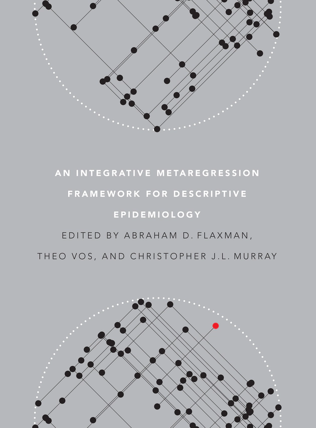

# 第五章、疾病負擔使用的估計方法

此檔案為林先和老師「疾病負擔測量:從方法到應用」課程文字稿

編輯整理：藍之辰、吳昀麇

# 前言

在估計YLD時要用到許多資料，依照不同國家大小不同，有些國家涵蓋範圍廣闊，例如英國涵蓋英格蘭、蘇格蘭等聯邦，需要搜集不僅是性別、年齡層，還有不同時間點的資料，往往需要百萬筆資料以上才能估計YLD。以台灣為例，不一定每個疾病都有足夠細微的資料，用以準確估計YLD，此時如何產生全面和足夠的資料，就是我們面臨的數據缺口（data gap）。

試想當遇到數據缺口的問題時，可以有哪些解決方法呢？除了蒐集資料外，也可以嘗試使用其他資料來估計缺漏的數值。當我們採用後者的方法時，優點是可以透過系統性的方式，整合不同數據來源，確保估計的品質，反之，也要注意採用的估計方式是否會產生錯誤的估計值，因為數據缺口的關係，難以判斷估計值的對錯。在本章節當中，要介紹GBD所使用的估計模型。

# DisMod-MR

GBD的估計模型為Bayesian Disease Modeling Meta-Regression（簡稱DisMod-MR），用迴歸的概念來描述流行病學，目前已有2個版本，並結合3個部分：疾病模型、統合分析回歸、貝氏理論架構，形成一個複雜的整合模型。

疾病模型（disease modeling）的概念常用在傳染病領域，用以預測傳染病動態模型。在GBD的應用中，則可以用來整合發生率、盛行率和死亡率之間的關係。當我們同時擁有三種資料（發生率、盛行率和死亡率）時，最好的狀況是不同來源的資料估計值是一致的（consistent）。不過，常常在實務中僅能取得其一種資料，這時可以利用其他兩種數值來進行估計。

[https://uwapress.uw.edu/book/9780295991849/an-integrative-metaregression-framework-for-descriptive-epidemiology/](https://uwapress.uw.edu/book/9780295991849/an-integrative-metaregression-framework-for-descriptive-epidemiology/)

統合分析回歸（Meta-regression）是一種統計方式，當對於同一個指標有多個估計值時，可以用來整合不同的資料來源，將估計值整併在一起，也可以納入其他相關的變項（covariates）進行估計。例如：假設教育程度和某個特定的健康指標有強相關，但在某一國家沒有實際測量該健康指標的情形下，可以使用教育程度這個covariate來對該健康指標進行估計。

貝氏理論架構（Bayesian framework），指在資料有限的狀態，依據現有的知識，加入先驗分佈（prior），去得到一個後驗分佈。例如：我們會預期中風的發生率和盛行率會隨年齡增加有上升的趨勢，那這個概念就可以當作先驗分佈加入分析當中。

# 疾病模型

## 疾病模型1.0

利用最簡單的分別方式，將人群分為有生病（Disease）、沒生病的族群，而沒生病的亦可稱為易感受族群（Susceptible），代表這個族群有得病的風險。在模型中我們假設易感受族群，會受到發生率影響，新病例數即是生病族群的輸入（inflow），並可以透過下圖觀察到幾個重要意義：

- 指向生病族群的箭頭→ 代表易感受族群中發病的人數，受到發生率影響。
- 離開生病族群的箭頭→代表離開疾病狀態的人數，受到死亡率影響。
- 方塊大小：指特定時間點、橫斷面，有多少數量的人在不同狀態。例如：生病族群的方塊代表盛行率。

在了解上述模型的意義後，我們可以發現會影響盛行率的就是兩個箭頭，分別代表生病族群的輸入和輸出，我們可以試著想想看，如果要實施介入計畫時，如何透過疾病模型來執行？

舉例來說，當我們目標是針對心血管疾病降低盛行率進行介入，可以透過模型得知要降低生病族群的輸入，因此要改變發生率，可以利用提高國人運動量的介入方式，同時，我們也可以採用較邪惡、消極的方式，不治療生病族群，會增加死亡率，讓輸出箭頭的人數變多，則也會降低盛行率（生病族群的方塊大小）。

從疾病模型來看，台灣的健保體系透過治療介入降低死亡率，同時也因為治療技術、醫療科技發展，發生率沒有降低的疾病，盛行率就會隨之升高。如果想降低盛行率，則要降低發生率。

疾病模型1.0可用於了解疾病發生率、盛行率、死亡率之間的關係，然而，每個疾病的機制往往更加複雜，例如在模型中沒有考慮到治癒的狀態。如果假設一個疾病除了區分生病、易感受，也有治癒狀態時，則會多出另一個方塊。同時這個模型也將死亡的部分簡化，健康的人們一樣會有死亡率的背景值。例如：有心血管疾病和沒有的族群，有不同的死亡率。因此，也有了疾病模型2.0。

## 疾病模型2.0

疾病模型2.0考慮更多狀態，能加入更多疾病背景知識，更多族群狀態，例如C代表治癒狀態，hm但表人口背景值死亡率，hf代表疾病死亡率，有心血管疾病和沒有的族群，有不同的死亡率。在較複雜的模型中，我們又需要哪些資料呢？從模型的箭頭與方塊來思考，我們需要的包含出生檔、死亡登記檔、疾病死亡率、人口分布等，根據不同疾病現況決定在流行病學上需要估計哪些數值。

在模型1.0當中，如果是盛行率沒有改變太多的慢性疾病，輸入和輸出的量是一樣的，可以得到盛行率、發生率、死亡率的關係，並用模型估計三者任一參數。而在模型2.0中，則使用微分方程式，常用在傳染病流行病學，在慢性病比較不常見，但是概念是一樣的。

## 疾病模型在GBD中的應用

- 讓不同的流行病學指標可以互相「借用」資訊，例如：在沒有盛行率的資訊時，可以用發生率來計算、盛行率。
- 「Data harmonization」：當發生率、盛行率、死亡率等三種資訊都有時，可以整合三種訊息，達到內部一致性。例如：發生率下降，我們會猜想盛行率也會下降。但是如果我們發現盛行率仍然持續上升，可以猜想可能死亡率下降很多，或是資料本身有誤。
    - 值得注意的是，我們常常會發現不同的資料來源，可信程度也不同。這時可以透過觀察三者之間的關係，可以了解三種指標的一致性。或利用不同統計方式，找到三者的最佳組合，例如：最小平方法。
- 缺點是需要很多假設，在非傳染性疾病需要假設非平衡狀態，但在傳染性疾病比較不適合。

# 系統性文獻回顧與統合分析

疾病負擔常需要透過文獻回顧來尋找資料來源，如果幸運的話，可以找到超過一個研究來估計同一個參數，以下分別舉兩個例子

## 美國抽菸盛行率

美國2010年抽菸盛行率。[https://pophealthmetrics.biomedcentral.com/articles/10.1186/1478-7954-12-5#additional-information](https://pophealthmetrics.biomedcentral.com/articles/10.1186/1478-7954-12-5#additional-information)

用Random effects來合併盛行率

- 在該研究中，有許多不同資料，在這種情境下，可以透過meta-analysis來進行資料整合。
- 上面這個抽菸盛行率使用random effects model，給予資料不同的權重，來計算美國整體的抽菸盛行率。
- 整體的信賴區間比單個研究範圍大，可能原因為這些資料來源有較高的異質性，同時$I^2$很高代表可能有其他因素沒有被考慮到。

## 歐洲失智症盛行率

Forrest plot of the meta-analysis of data from single studies. The lower diamond in the graph represents the global cumulative estimate.[https://content.iospress.com/articles/journal-of-alzheimers-disease/jad180416](https://content.iospress.com/articles/journal-of-alzheimers-disease/jad180416)

- 該文章在2018年發表，許多國家在數據中約有10%的盛行率，但其中一兩個國家差異很大，研究異質性很高。
- 造成異質性高的原因，可能為不同研究、國家的年齡結構，可能這兩個國家的研究族群較多高齡者，抑或收按年齡限制高於85歲以上，收案族群與其他國家不同，再加上臨床知識，並觀察到年齡增加，失智症盛行率上升，這時可嘗試使用統合分析迴歸。

## 統合分析回歸

Meta-regression結合不同研究的資料，可以獲得穩健的估計值，並且也可以加入群組層級（group level）的共變項，例如：社會人口指標（Socio-demographic Index, SDI）、疫苗覆蓋率、醫療資源可近性等。例如我們可加入其他變因，了解年齡與失智症盛行率的關係。當使用平均年齡估計高血壓盛行率時，也可以加入其他教育程度等變項。同時，迴歸的另一好處是可用來預測，預測特定年齡族群的盛行率，在缺乏實際點估計資料時，能藉由其他現有、可取得的資料推算該年齡層的盛行率。所以，總結來說，使用meta-regression的時機，是在我們有擁有許多資料來源，並推測可能有其他原因影響資料的異質性，則可以透過不同變項間的關係，預測沒有蒐集到資料的估計值。

Meta-regression analysis showing the association between altitude, mean age and the prevalence of hypertension. There was a trend towards increased prevalence of hypertension with increasing altitude irrespective of age (p=0.06). The meta-regression was based on imputed mean age using either the one given or imputing from a study that had similar age range (in one case using the median age for the age range reported). It was not possible to use age as a confounder due to inadequate data. The sizes of the circles correspond to the sample sizes of the included studies. [https://heart.bmj.com/content/101/13/1054.long](https://heart.bmj.com/content/101/13/1054.long)

在我們提到群組層級的變項，想想看有哪些國家層面的預測指標可以被使用呢？事實上國內生產毛額（Gross Domestic Product, GDP）、年齡、教育程度、死亡率、身體質量指數（Body Mass Index, BMI）、全民健康覆蓋所計算的醫療資源可近性等都可以使用，在全球疾病負擔的研究中，有上百個的共變項。

在data pooling的過程中，若觀察到與直覺不相符合的結果，如美國抽菸盛行率、 歐洲失智症盛行率的例子，受到年齡分佈的影響，這時要加入臨床和公共衛生的知識、批判（judgement），加入貝氏理論的概念Bayesian framework，於下一段會提到。

# 貝氏理論架構

貝氏理論有很龐大的發展結構，在此先以簡單的概念讓讀者了解貝氏理論在疾病負擔的應用。貝氏理論與以往所學模型的差距，在於先驗知識（prior knowledge）的加入，得到best guess。舉例來說：當我們觀看瑞士網球運動員—羅傑·費德勒的比賽時，想預測他的下一球最有可能發球到球場哪個位置？就是我們說的best guess，而我們需要哪些資料呢？分為兩種：其一是費德勒過往球賽的發球數據，將所蒐集到的歷史資料作為先驗知識（prior），如下圖所示的紫色區域；另外，則是我們在該場比賽中，所觀察到的資料（data），包含他的發球姿勢、會影響發球落點的因素等，如紅色區域。結合兩種資料，重疊的部分白色區域，就是我們所得到的最佳解（best guess），也可以稱作後驗知識（posterior）。

Federer’s Serve Map. [http://gamesetmap.com/?tag=spatial-analytics](http://gamesetmap.com/?tag=spatial-analytics)

[https://www.fil.ion.ucl.ac.uk/~wpenny/research/bi.html](https://www.fil.ion.ucl.ac.uk/~wpenny/research/bi.html)

將貝氏理論應用在流行病學，prior就是臨床、公衛知識，例如：冠狀動脈疾病的發生率會隨著年齡上升而下降，將先驗知識加入資料當中，若我們觀察到相反的現象，應推測影響原因，可能是受到小樣本、或資料品質本身不好的影響。透過參考先驗知識，可以更平衡資料，幫助蒐集到真實世界的流行病學資料。在下列貝氏推論的公式中，後驗機率是建立在先驗機率的基礎上，簡單來說，就是當我們納入新事件的資訊後，所更新事件發生的機率。

$$p(\theta \mid y) \propto p(y \mid\theta)p(\theta) \\ \text{posterior} \propto \text{likelihood} \cdot \text{prior}$$

- $p(y \mid \theta)$: new data
- $p(\theta)$: prior knowledge

在疾病負擔中，我們需要什麼樣的先驗知識呢？常見的有年齡分佈、空間地理層次的資料，並在以下分別說明。

## 年齡分佈

因為我們總是預設疾病與年齡呈連續性(continuity)與單調性(monotonicity)，連續性是指年齡和疾病發生率會有平滑的關係，單調性是指方向一致，不會忽高忽低，如同前面歐洲失智症盛行率的例子，可以加入不同國家年齡分佈的資訊。

## 空間地理層次

Map of the 21 GBD regions. [https://pubmed.ncbi.nlm.nih.gov/23682350/](https://pubmed.ncbi.nlm.nih.gov/23682350/)

此外，疾病負擔在計算國家點估計值時，在地理區域可以區分四到五種層次：全球(Global)、跨區域(Super-Region)、區域(Region)、國家(Country)等，並假設同一個區域的國家，會有相依的性質。在同一個區域中，如某國家缺少失智症的資料，則會往上一個層級，從區域中尋找其他有失智症資料的國家，當成先驗知識來協助估計該區域缺少失智症盛行率的國家進行估計。

利用相同區域其他國家的資料來估算，常引起科學家對於國家分類定義上的歧見，如在亞洲有High-income Asia Pacific Region，包括日本、韓國、新加坡等，並將台灣、中國、北韓分在另一區域。雖然我們無法排除可能受到政治因素影響，而有這樣的分別。不過，可以看到這樣的分類方式，可能造成台灣某些疾病可能受到中國、北韓的資料影響，將同一分類國的資料做為先驗知識，造成台灣某些疾病的數值估計與實際差異慎大。因此，解讀疾病負擔的參數時，也要特別注意該國家是否有疾病的資料，以及是不是有使用區域層級或更高層次資料的進行估計。

# DisMod-MR的實際應用

在DisMod當中有三個概念，雖然不是很完美，但是為了要估計參數，也是必要可以使用的方式。除了能確定資料來源，因為所有的參數都是使用相同的步驟和方式，可達到內部一致性（Internal consistency）。不過我們又怎麼確認DisMod真的有用、有好的敏感度呢？

在確認DisMod估計數值的過程，會使用外部驗證（External validation）與交叉驗證（Cross validation）。外部驗證是指用其他團隊或其他來源的資料，來檢驗估計值的準確性；交叉驗證屬內部驗證的一種，我們會假裝資料集中有些資料不見，隨機刪除1%的資料，並利用剩下的資料來估計遺失1%。刪除部分的資料集為masked的資料，而原始資料則是unmasked，接者比對masked跟unmasked估計值有沒有差異，目的是在確認模型能不能有穩健的估計值。在疾病負擔團隊有執行很多交叉驗證，不過仍然是一種內部驗證，不能確定跟外部比較是否準確。

DisMod-MR的應用廣泛，在聯合國永續發展目標（Sustainable Development Goals, SDGs）中的17 項目標（Goals）及169 項細項目標（Targets），其中50多個和健康相關的細項目標，就是使用全球疾病負擔以DisMod-MR的模型來估計的結果評估健康系統的表現。

有趣的是，台灣在Indicator 3.3.4：年齡標準化B型肝炎（ Hepatitis B incidence per 100,000 population），發生率很高，估計每十萬人口約5,000例（5%），代表每年約100人會被感染B型肝炎，事實上應該是不可能的，因為台灣最主要的傳染途徑為垂直感染，在台灣針對預防新生兒B型肝炎政策推行已久，不太可能有如此高的發生率。而推測這樣的原因，可能是因為在DisMod-MR的計算過程中，因為輸入過去的盛行率做為先驗知識，盛行率受到過去已感染的成年人影響，居高不下，反觀1980年代後，B型肝炎感染率快速下降。雖然該估計值無法反映現實，但過去向全球疾病負擔團隊反應也沒有用，因為使用DisMod-MR會受到要維持所有數值的內部一致性的限制。

Performance of the HAQ Index and 25 individual causes by the fourth SDI quartile. [https://pubmed.ncbi.nlm.nih.gov/28528753/](https://pubmed.ncbi.nlm.nih.gov/28528753/)

再舉一個例子，台灣的麻疹死亡率表現分數為80分，如果沒有死亡數據會更接近100分。然而，當我們實際檢查資料時，會發現台灣過去20年都沒有麻疹死亡案例，因為輸入的先驗知識資料，受到鄰近國家或相同區域國家的資料影響，可能是北韓或中國等國家麻疹死亡率較高，再加上台灣本身麻疹死亡率非常低，樣本數非常小，所以受到先驗知識的影響會提高。

# 總結

本章節解釋了全球疾病負擔團隊使用的DisMod-MR方法，與如何應用DisMod-MR來看疾病在全球或區域大方向的分佈。不過，當我們想看更細部的年齡分層、國家、更小的區域層級，解讀數據要更家小心，若可以諮詢當地的流行病學家，了解疾病在當地發生的實際情形會更好。

# 參考資料

1. Dwyer-Lindgren, L., Mokdad, A. H., Srebotnjak, T., Flaxman, A. D., Hansen, G. M., & Murray, C. J. (2014). Cigarette smoking prevalence in US counties: 1996–2012. Population Health Metrics, 12(1). [https://doi.org/10.1186/1478-7954-12-5](https://doi.org/10.1186/1478-7954-12-5)
2. Bacigalupo, I., Mayer, F., Lacorte, E., di Pucchio, A., Marzolini, F., Canevelli, M., di Fiandra, T., & Vanacore, N. (2018). A Systematic Review and Meta-Analysis on the Prevalence of Dementia in Europe: Estimates from the Highest-Quality Studies Adopting the DSM IV Diagnostic Criteria. Journal of Alzheimer’s Disease, 66(4), 1471–1481. [https://doi.org/10.3233/jad-180416](https://doi.org/10.3233/jad-180416)
3. Mingji, C., Onakpoya, I. J., Perera, R., Ward, A. M., & Heneghan, C. J. (2015). Relationship between altitude and the prevalence of hypertension in Tibet: a systematic review. Heart, 101(13), 1054–1060. [https://doi.org/10.1136/heartjnl-2014-307158](https://doi.org/10.1136/heartjnl-2014-307158)
4. Demaj, D., Demaj, D., Demaj, D., Demaj, D., Demaj, D., Demaj, D., Demaj, D., Demaj, D., Demaj, D., & Demaj, D. (2014, February 19). GameSetMap. GameSetMap. [http://gamesetmap.com/?tag=spatial-analytics](http://gamesetmap.com/?tag=spatial-analytics)
5. [https://www.fil.ion.ucl.ac.uk/~wpenny/research/bi.html](https://www.fil.ion.ucl.ac.uk/~wpenny/research/bi.html)
6. Forouzanfar, M. H., Moran, A. E., Flaxman, A. D., Roth, G., Mensah, G. A., Ezzati, M., Naghavi, M., & Murray, C. J. (2012). Assessing the Global Burden of Ischemic Heart Disease: Part 2: Analytic Methods and Estimates of the Global Epidemiology of Ischemic Heart Disease in 2010. Global Heart, 7(4), 331. [https://doi.org/10.1016/j.gheart.2012.10.003](https://doi.org/10.1016/j.gheart.2012.10.003)
7. GBD 2015 Healthcare Access and Quality Collaborators. Electronic address: [cjlm@uw.edu](mailto:cjlm@uw.edu), & GBD 2015 Healthcare Access and Quality Collaborators (2017). Healthcare Access and Quality Index based on mortality from causes amenable to personal health care in 195 countries and territories, 1990-2015: a novel analysis from the Global Burden of Disease Study 2015. Lancet (London, England), 390(10091), 231–266. [https://doi.org/10.1016/S0140-6736(17)30818-8](https://doi.org/10.1016/S0140-6736(17)30818-8)