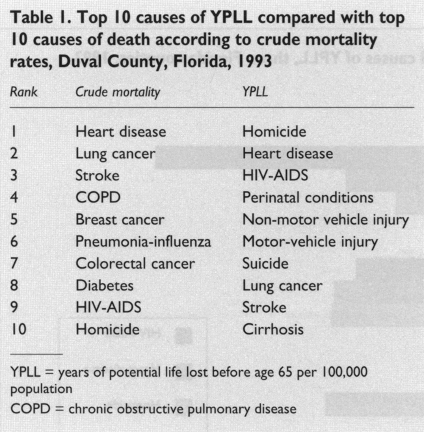

# 第二章、死亡率測量：生命損失人年數及生命表

此檔案為林先和老師「疾病負擔測量:從方法到應用」課程文字稿

編輯整理：藍之辰、吳昀麇

回顧上一章介紹疾病負擔中常見的測量指標：失能調整人年（Disability-adjusted Life Years，簡稱DALYs）定義為生命損失人年數（Years of Life Lost，簡稱YLLs）加上失能損失人年數（Years Lived with Disability簡稱YLDs）。其中，YLLs指的是比預期存活年數提早死亡所造成的生命損失，而如何透過生命表計算每個人預期的生命年數和生命損失人年數將在本章節說明。

# 第一節、計算生命損失人年數（YLLs）的意義

首先，我們先試著比較粗死亡率和潛在生命損失人年率（Years of potential life lost, YPLL）排名的不同(此YPLL所使用的預期壽命和我們平常計算YLL略為不同，YPLL是以65歲當作所有人的預期壽命，YLL是以生命表來計算)。如表 1，以美國佛羅里達州的杜爾瓦縣（Duval County）1993年的死亡率和YPLL來做比較，因「他殺(Homicide)」所造成的粗死亡率排名第十名，但以 YPLL來看則是第一名；而「愛滋病（HIV-AIDS）」造成的粗死亡率排名九名，以YPLL來看則上升到第二名。他殺及愛滋病的死亡年齡傾向發生在年輕族群中，造成粗死亡率及生命損失人年排名差異。

表 1、美國佛羅里達州杜瓦爾縣，1993年潛在十大生命損失年數與粗死亡率之比較[1]

粗死亡數和YLLs的計算方式分別如下，粗死亡數是將當年度的總死亡人數加總；而YLLs的是將各年紀的死亡人數（N），去乘上該年紀的平均餘命（e），再將各年紀損失的人年數加總（式 1）

式1

$$生命損失人年數(YLLs)=\sum N \times e$$

平均餘命（life expectancy）則是從生命表（life table）計算而來。以全球疾病負擔（Global Burden of Disease, GBD）計畫來說，透過建立每個年齡的生命表計算預期存活年齡。以表 2舉例，0歲的平均餘命是86.02年，表示一個0歲的人平均預期可以活到86.02歲；反之，對一位50歲的人來說，平均剩餘的壽命剩下37.05年，歲數與平均餘命加總會是87.05年，比起0歲預期壽命更長；對於一個100歲的人，平均餘命則還有2.23年，預期壽命為102.23年[2]。

不同年齡所計算的預期存活年數不同，對於年紀較大的人來說，總預期存活年數會比較長。這樣的差異來自生命表中平均預期壽命的先決條件，計算特定年齡平均餘命時，僅計算能存活到該年齡的人群，例如計算50歲的平均餘命時，已篩選可以活超過50歲的人群進行計算。

# 第二節、各國特定的生命表與GBD標準生命表

前面提到，計算YLLs時，需要靠生命表計算每個年齡的預期壽命，依不同死亡率計算常分為兩種。第一種是各國特定的生命表（country-specific life table），由各國家衛生統計部門每年依據該國死亡率建立並發表。第二種為GBD所建立的標準生命表（Standard life table），其採用年齡別死亡率並非來自單一國家，而是定義在所有國家中，該年齡死亡率最低的國家之死亡率進行計算。舉例來說，若澳洲有最低的0歲死亡率，日本有最低的20到24歲死亡率，則個別使用澳洲0歲及日本20到24歲死亡率來計算全球生命表。由上述的定義可以看出，GBD的標準生命表並非單一國家、族群可以達到的最高平均餘命。所以，如果想針對各國生命損失人年進行比較，應該要使用國家特定生命表，還是GBD所建立的標準生命表呢？

進行不同國家YLLs比較時，從國家特定生命表來看，每個國家的生命表都不同，例如：2019年1-4歲年齡層，新加坡生命表平均餘命高達83.98歲[3]，但在中非共和國僅有約55.90歲[4]。反之，當使用標準生命表計算時，則假設不論是來自哪個國家，預期能存活生命年數都相同。

我們一般提到平均餘命常常是在指0歲的平均餘命，即出生時的平均餘命。實際上，要評估平均餘命最好的方式，是針對一個出生世代追蹤從出生到死亡的年數。舉例來說，若要評估2021年出生世代平均餘命，最好找一個2021年的出生世代，追蹤全部的人到死亡，再計算該世代的平均歲數。然而，現實的考量是我們如何在2021年，去估計或預測2021年出生世代的平均餘命為何呢？

生命表是對一個出生世代進行模擬，利用目前各年齡別死亡率來計算，並假設年齡別死亡率在未來不會改變。像是對一個50歲的人來說，現在的平均餘命會和50年後一樣。舉個生活實例來看，當使用Google地圖來估計交通所需花費的時間，Google地圖是依據當下每一台車在各段路程的平均速度預測交通時間，加總為整段行程的花費時間，和生命表的計算很像。

# 第三章、建立生命表

以下會介紹如何利用各年齡層的死亡率來建立生命表，並計算平均餘命。

首先，所需要的資料是每一個年齡組別的死亡機率，常見使用單年齡或使用5歲為分組單位。這裡，我們使用的是5歲為一組的死亡機率，除了0歲、1-4歲、以及100歲以上。

接著，我們要假設有一個10萬人的世代，透過這10萬人和各年齡的死亡機率，來去計算假設未來這十萬人所經歷的死亡機率和當下各年齡層死亡機率是一樣的情況下，他們會預期活到幾歲。

舉例來說，當0歲時的死亡機率是0.0451，我們可以計算出，10萬人在經歷0歲的這一年以後，會有4,510人死亡，意即有95,490人活過完整的一年，而4,510個死亡的人，我們假設每個人都活了0.1年，因此他們共計活了95,490乘上1年和4,510乘上0.1年，加總得到他們共存活了95,941年。

上述的計算當中，我們假設每個在0歲這一年死亡的人都活了0.1年，主要是因為我們無法得知他們實際上共活過多少時間，所以必須要假設他們在一年中總共活多少時間。從過去的經驗來看，對0歲的人來說，絕大多數的死亡是發生在出生的一個月內，所以對0歲來說我們假設0.1年。但對於5歲以後，一般較合理的猜測是每個人都存活半年，因此，在計算該年度死亡人數存活人年時，常使用0.5年來計算。

承上述的舉例，我們可以將第一年（0歲）的剩餘存活人口，亦即95,490人，乘上1-4歲年齡組別的死亡機率0.0109，算出有1,041人會在1-4歲死亡，剩下94,449人會存活。其中，死亡的1,041人，假設只存活0.4年的時間，所以在這個年齡層當中，存活總年數為94,449人乘上4年和1,041人乘上0.4*4年，加總得到他們共存活了379,462年。

當計算完一個年齡組別，對於下一個年齡組別，也是利用一樣的運算方式。以同樣的計算方式

持續計算到100歲（如下表）。

當要計算0歲的平均餘命時，必須加總這群出生世代從0歲到100歲以上所有經歷的時間，除以十萬人，得到0歲平均餘命。對於其他年齡來說，則是將該年齡往後所經歷的時間加總，除以該年齡組別的總人數，得到該年齡平均餘命。

當有完整的世代資料時，可以準確計算平均餘命，但這樣的方法執行困難，一般來說，實際且可行的是使用預測方式來計算，利用每一個年齡組別的年中人口和死亡數進行預測。然而，需要注意的是，在預測平均餘命背後很強的假設，其假設年齡別死亡率在未來幾十年都不會改變。然而，年齡別死亡率在未來的30年或50年真的不會改變嗎？一般來說，我們知道死亡率在過去幾十年當中一直在降低。

# 專有名詞複習

- Disability-adjusted Life Years, DALYs：失能調整人年
- Years of Life Lost, YLLs：生命損失人年數

# 文獻

1. McDonnell S, Vossberg K, Hopkins RS, Mittan B. Using YPLL in health planning. Public Health Rep. 1998 Feb;113(1):55–61.
2. GBD 2010 country results: a global public good. The Lancet. 2013 Mar 23;381(9871):965–70.
3. Complete Life Tables for Singapore Resident Population, 2018-2019 [Internet]. Department of Statistics Singapore; 2020 Jun. Report No.: ISSN: 2591-7560. Available from: https://www.singstat.gov.sg/-/media/files/publications/population/lifetable18-19.pdf
4. Global Burden of Disease Collaborative Network. Global Burden of Disease Study 2019 (GBD 2019) Life Expectancy and Healthy Life Expectancy 1990-2019 [Internet]. Institute for Health Metrics and Evaluation (IHME); 2020 [cited 2021 Mar 8]. Available from: http://ghdx.healthdata.org/record/ihmde-data/gbd-2019-life-expectancy-HALE-1990-2019