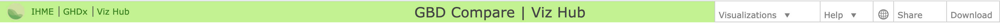
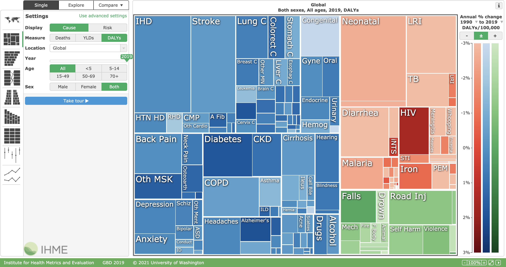

# 實作：全球疾病負擔視覺化工具介紹

此檔案為林先和老師「疾病負擔測量:從方法到應用」課程文字稿

編輯整理：藍之辰、吳昀麇

## IHME網站

[https://vizhub.healthdata.org/gbd-compare/](https://vizhub.healthdata.org/gbd-compare/)

[https://vizhub.healthdata.org/gbd-compare/](https://vizhub.healthdata.org/gbd-compare/)

## IHME網站概覽

IHME的視覺化網站的資料會在每一個版本的GBD結果發表時一併更新，可以在網站最下方看到所呈現的資料是屬於哪一個版本的(以上圖所看到的是GBD 2019)。以下對於這個網站做一個說明。

網站最上方的一列如下：

### 左上角

- 點選IHME字樣可以回到IHME的網站去瀏覽，也可以sign up email，這樣可以收到最新的資訊。
- GHDx指的是Global Health Data exchange，當看到IHME這個網站上很多漂亮的數據的時候，一定要記得問自己，這些資料是從何而來？而IHME也將他們所使用的資料建立成GHDx網站以供查詢，你可以針對一個國家進行查詢，只要在country的地方輸入國家名稱即可。你可以看到他們所使用的資料不只是一般我們所認知的政府人口資料庫，他們也使用了很多網站上的公開資料，像是期刊文章、疾管署的監測資料、新聞報導等等。
- IHME也有很多其他的視覺化軟體可以透過Viz Hub找到。

### 右上角

- 調整語言：IHME的網站有多個語言可以選擇。
- 分享結果：如果需要分享所得到的結果也可以選取Share按鍵中的Screenshot。
- 下載結果、重置圖表：想要重新製作新的圖表，也可以用download這個工具將資料下載下來重新製圖。

## 視覺化工具

在主要的資料呈現面板當中，我們看到的是有三種圖表呈現方式的選擇，而左邊共呈現九種圖表類型：

第一種圖表呈現方式是**Single**，也就是單一圖形。舉Treemap 來看，它可以看到全球各種疾病DALYs所佔的百分比。圖中有三大類疾病，分別用藍色(NCDs)、紅色(Group 1 diseases)、綠色(Injury)來做表示。其中，如果你選取advanced setting，你可以看到有一個Level的調整樞紐，這指的是疾病層級(cause hierarchy)，當你選到Level 1的時候，疾病會分成三大類，Level越高，疾病類別會越細。舉例來說，中風(stroke)在level 1的時候屬於NCD這個類別，在level 2時是在CVD這個類別之中，level 3就是stroke，level 4會再分成ischemic stroke, hemorrhagic stroke等等。在看這個圖的時候，除了看各類疾病的負擔占比，你可能會想知道那些疾病在過去幾十年間是在增加或是減少的，那你就可以選擇右邊的工具做調整，按+圖形就會顯示過去1990-2019年間是在增加的。你也可以調整年代，可以將年代改為近十年，像是2009-2019。最後，在看這個圖的時候，你或許會想，過去在增加的這些疾病，有多少是可以透過危險因子控制來改善的，你可以在左邊選擇Risk這個按紐，它就會顯現出，各個疾病中有多少比例是可以透過危險因子控制來做改善的。當知道各疾病的占比之後，可能會想知道單一疾病在各個國家的分布為何？這時候你就可以選擇map，若你只想看單一疾病之疾病負擔比較高的國家，則可以將下方的軸限縮到想看的部分，然後在set scale，就可以顯現出來了。

第二種圖表呈現方式是**Explore**，上面會呈現map，下面則是選擇你想看的相對應圖表。我們以平均餘命來說，你可以選擇decomposition圖，便可以知道這些國家，從1990年到2019年平均餘命的改變，且可以了解是那些疾病的進步然平均餘命增加的。

第三種圖表呈現方式是**Compare**，可以選擇不同的年份、年齡族群、性別、或是國家等等的來做比較。這裡必須要注意的是，當你在比較不同的國家、年份時，由於人口組成並不相同，必須選擇advanced setting，然後將年齡改為age-standardized來進行比較。

GBD compare呈現了兩百多個國家、三百多個疾病、以及八十幾個危險因子的估計值，數據很完整，然而，在使用的時候應相當小心，必須瞭解資料的來源、可能的限制、估計值的不確定性。